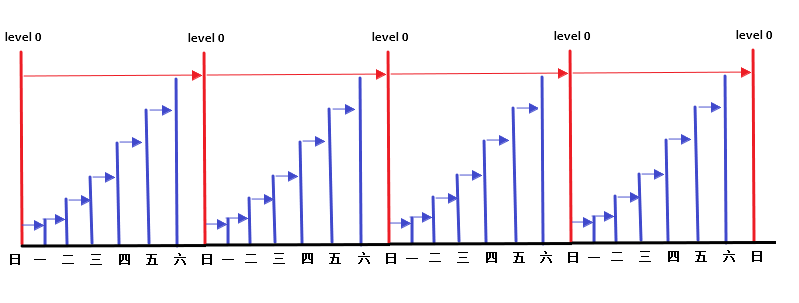
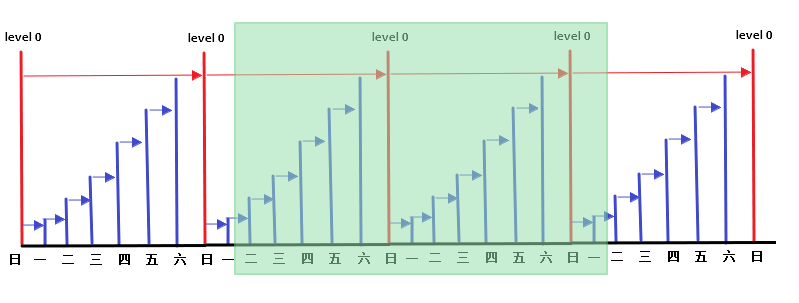

# 冷备计划的制定和实施

> 2019.12.15 BoobooWei

[TOC]

## 概念

> 注意：增量备份（通用）=差异增量（Oracle） 差异备份（通用）=累计增量（Oracle）
> 增量备份（通用）:相对于上一次的备份
> 差异备份（通用）:相对于上一次的全备

- 包含从最近一次备份以来被修改或添加的数据块.可以分为**差异增量备份**和**累计增量备份**
- 差异增量备份：仅仅包含n级或n级以下被修改过的数据块。备份数据量小，恢复时间长。
- 累计增量备份：仅仅包含n-1级或n-1级以下被修改过的数据块。备份数据量大，恢复时间短。
- 0级增量备份相当于一个完整备份,该备份包含所有已用的数据块文件,与完整备份的差异是完整备份不能用作级增量备份的基础

## 冷备计划

* 备份周期：一周一全备，每天一增备
* 备份数据保留策略：保留近14天的备份

### RMAN备份周期

一周一全备，每天一增备



- 每周日晚做 0 级备份,就是备份所有使用过的数据块. 
- 周一做 1 级增量,备份小于等于 1 以来备份后发生变化的块,前面有个 0 级备份.所以备份当天的变化. 
- 周二做 1 级增量,备份小于等于 1 以来备份后发生变化的块,前面有个 1 级备份.所以备份当天的变化. 
- 周三做 1 级增量,备份小于等于 1 以来备份后发生变化的块,前面有个 1 级备份.所以备份当天的变化. 
- 周四做 1 级增量,备份小于等于 1 以来备份后发生变化的块,前面有个 1 级备份.所以备份当天的变化.
- 周五做 1 级增量,备份小于等于 1 以来备份后发生变化的块,前面有个 1 级备份.所以备份当天的变化.
- 周六做 1 级增量,备份小于等于 1 以来备份后发生变化的块,前面有个 1 级备份.所以备份当天的变化.
- 周日做 0 级增量, 备份所有使用过的数据块. 

### RMAN备份保留策略

保留近14天的备份



实现方式：

1. Linux计划任务`crontab`
2. RMAN自带的`retention policy`

#### Linux计划任务`crontab`

保留14天的备份数据，当今天是周一时，会保留 近14天的数据，删除两周前的周一的数据。

| 周日 | 周一 | 周二 | 周三 | 周四 | 周五 | 周六 |
| ---- | ---- | ---- | ---- | ---- | ---- | ---- |
|      | 清除 | 保留 | 保留 | 保留 | 保留 | 保留 |
| 保留 | 保留 | 保留 | 保留 | 保留 | 保留 | 保留 |
| 保留 | Now  |      |      |      |      |      |

因此保留14天的备份数据，可以将数据恢复的时间范围为：`上周周日~本周当前`

#### RMAN自带的`retention policy`

保留14天的备份数据，即每份备份数据的冗余备份数量为2

```sql
configure retention policy to redundancy 2;
```

### RMAN备份脚本

待补充

## 冷备实施

待补充


